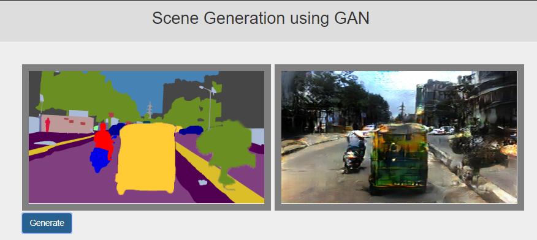
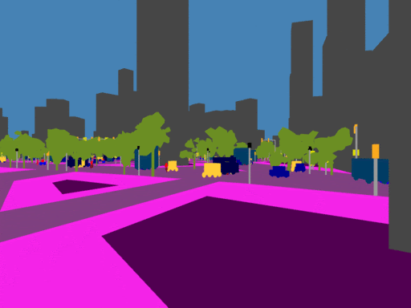

# Conditional GAN on Indian Driving Dataset
#### Using the Pix2Pix architecture on the Indian Driving Dataset 

##### Aishwarya Rao [@ash-rao](https://github.com/ash-rao) , Arjun Kini [@ArjunKini](https://github.com/ArjunKini) , Nikitesh Singh [@Nikiteshh](https://github.com/Nikiteshh)

Project Title: Scene Generation Using Deep Learning

Description:
Our project aims to use GANs to generate realistic images from a purely semantic representation of a scene. We
survey and compare models that can be used on any kind of scene and then train these architectures on an unexplored
dataset - The Indian Driving Dataset. Through this project, we can arrive at answers to the following questions.
One, the scope of generative adversarial networks in interpreting and understanding textures and variables in a
complex scene. Two, the applications of such a model in the field of gaming and virtual reality.
This project implements the following,
1. Generate realistic scenes of Indian Driving Dataset based on semantic represenations of the objects in the scene
2. Integrate the model with a gaming interface (Unity) to allow a walkthrough of our generated scenes.
3. Allow the user to choose a modification (such as adding new elements into the scene), keeping in mind spatial
properties, and generate the equivalent image.

#### Requirements
Python 3.6
PyTorch 1.0.1
Cuda
Flask 
Dataset from http://idd.insaan.iiit.ac.in/

#### Running
-Train the model by using the Jupyter Notebook in model folder

-Deploy model using Flask

#### Results - Flask

#### Results - Unity 
Semantic City             |  Generated City
:-------------------------:|:-------------------------:
 | 

Unity files will be uploaded soon!

#### Resources
[Pix2pix](https://phillipi.github.io/pix2pix/)

[Pix2pixHD](https://github.com/NVIDIA/pix2pixHD)

[Generative Cities](https://github.com/DerTarchin/Pix2Pix-Generative-Cities)
